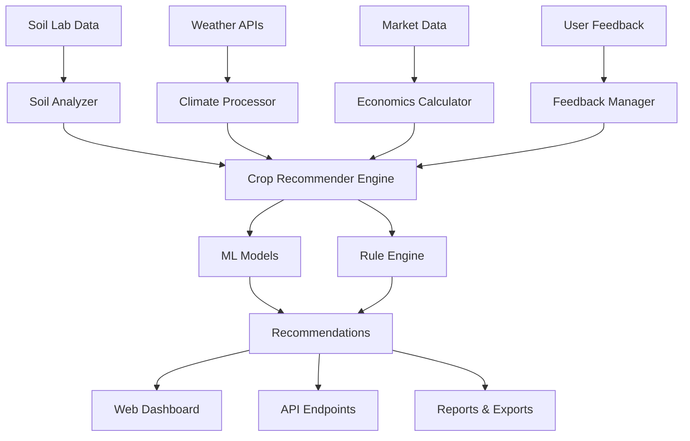

# Project Overview: Precision Farming Playground


## 🌾 Problem Statement

Modern agriculture faces unprecedented challenges:
- **Global food security**: Need to feed 9.7 billion people by 2050
- **Resource constraints**: Limited arable land, water scarcity, soil degradation
- **Climate change**: Unpredictable weather patterns, extreme events
- **Economic pressures**: Rising input costs, volatile market prices
- **Environmental impact**: Need for sustainable farming practices
- **Knowledge gaps**: Limited access to scientific farming methods

Traditional farming relies heavily on experience and intuition, often leading to:
- Suboptimal crop selection for soil conditions
- Over/under-application of fertilizers and water
- Reactive rather than preventive pest management
- Economic losses due to poor planning
- Environmental degradation from unsustainable practices

## 🎯 Solution Approach

The **Precision Farming Playground** addresses these challenges by providing:

### 1. **Data-Driven Decision Making**
- Scientific soil analysis and interpretation
- Weather-integrated crop planning
- Evidence-based recommendations
- Historical data analysis and trends

### 2. **Intelligent Crop Matching**
- AI-powered crop recommendation engine
- Multi-factor suitability analysis
- Economic viability assessment
- Risk factor evaluation

### 3. **Economic Optimization**
- Comprehensive cost-benefit analysis
- Market price integration
- ROI calculations and projections
- Break-even analysis

### 4. **Sustainable Practices**
- Resource-efficient farming methods
- Soil health improvement strategies
- Environmental impact minimization
- Long-term sustainability planning

### 5. **Accessible Technology**
- User-friendly web interface
- Mobile-responsive design
- API for third-party integrations
- Command-line tools for automation

## 📊 Repository Structure

```
Precise_Farming_Playground/
│
├── 📚 Documentation & Knowledge Base
│   ├── docs/                     # Comprehensive guides
│   ├── README.md                 # Project overview
│   └── LICENSE                   # Open source license
│
├── 🔬 Core Analysis Engine
│   ├── src/                      # Core Python library
│   │   ├── soil_analyzer.py      # Soil analysis & health scoring
│   │   ├── crop_recommender.py   # ML-powered crop matching
│   │   ├── economics_calculator.py # Financial modeling
│   │   ├── stats_visualizer.py   # Data visualization
│   │   └── utils.py              # Shared utilities
│   │
│   └── models/                   # ML models & experiments
│       ├── trained/              # Production models
│       └── experiments/          # Research & tuning
│
├── 📱 User Interfaces
│   ├── streamlit_app/            # Web dashboard
│   │   ├── app.py               # Main application
│   │   └── pages/               # Individual tools
│   │
│   ├── api/                     # REST API server
│   │   ├── main.py              # FastAPI entry point
│   │   └── routes/              # API endpoints
│   │
│   └── cli.py                   # Command-line interface
│
├── 📊 Data & Examples
│   ├── data/                    # Sample datasets
│   │   ├── raw/                 # Original data
│   │   └── processed/           # Cleaned data
│   │
│   ├── examples/                # Usage examples
│   └── notebooks/               # Jupyter analysis
│
└── 🧪 Quality Assurance
    ├── tests/                   # Unit & integration tests
    └── requirements.txt         # Dependencies
```

## 🔄 Data Flow Architecture



## 🎯 Target Users

### 1. **Individual Farmers**
- Small to medium-scale operations
- Looking to optimize crop selection
- Want to improve soil health
- Need economic guidance

### 2. **Agricultural Consultants**
- Providing services to multiple farmers
- Need standardized analysis tools
- Require batch processing capabilities
- Want detailed technical reports

### 3. **Research Institutions**
- Agricultural universities
- Government research agencies
- Private research organizations
- Need data analysis and modeling tools

### 4. **Technology Integrators**
- IoT platform developers
- Farm management software companies
- Agricultural equipment manufacturers
- API integration requirements

### 5. **Students & Educators**
- Agricultural science programs
- Online learning platforms
- Training institutions
- Need educational resources

## 💡 Key Innovation Areas

### 1. **Multi-Modal Analysis**
- Combines soil, weather, economic, and risk factors
- Weighted scoring algorithms
- Machine learning integration
- Rule-based expert systems

### 2. **Real-Time Adaptation**
- Dynamic weather integration
- Market price updates
- Seasonal adjustments
- Historical trend analysis

### 3. **Contextual Recommendations**
- Location-specific advice
- Farm size considerations
- Equipment availability
- Local market conditions

### 4. **Continuous Learning**
- User feedback integration
- Model performance tracking
- Seasonal updates
- Regional customization

## 🚀 Implementation Phases

### **Phase 1: Foundation (Current)**
- ✅ Core soil analysis engine
- ✅ Basic crop recommendation system
- ✅ Web dashboard MVP
- ✅ CLI tools
- ✅ Documentation framework

### **Phase 2: Enhancement (Q2 2025)**
- 🔄 Advanced ML models
- 🔄 Weather API integration
- 🔄 Market data feeds
- 🔄 Mobile application
- 🔄 User authentication system

### **Phase 3: Integration (Q3 2025)**
- 📋 IoT sensor connectivity
- 📋 Satellite imagery analysis
- 📋 Drone data integration
- 📋 Laboratory partnerships
- 📋 Multi-language support

### **Phase 4: Expansion (Q4 2025)**
- 📋 Blockchain traceability
- 📋 Supply chain integration
- 📋 Marketplace features
- 📋 Advanced analytics
- 📋 Community features

## 📈 Success Metrics

### **Technical Metrics**
- Model accuracy (>85% for crop recommendations)
- System uptime (>99.5%)
- Response time (<2 seconds for analysis)
- API reliability (>99.9%)

### **User Adoption**
- Active users (target: 10,000+ farmers)
- Geographic coverage (target: 25+ countries)
- Session duration (target: >15 minutes average)
- Return usage (target: >70% monthly retention)

### **Agricultural Impact**
- Yield improvement (target: >20% average)
- Cost reduction (target: >15% input costs)
- Soil health improvement (measurable increase)
- Sustainable practice adoption (>60% users)

### **Economic Impact**
- Revenue increase per farm (target: >25%)
- ROI improvement (target: >30% vs traditional)
- Reduced crop failures (target: <5% failure rate)
- Market price optimization (>10% better prices)

## 🤝 Open Source Philosophy

### **Community-Driven Development**
- Open source codebase (MIT License)
- Community contributions welcomed
- Transparent development process
- Public roadmap and issue tracking

### **Knowledge Sharing**
- Comprehensive documentation
- Educational resources
- Best practices sharing
- Research collaboration

### **Global Accessibility**
- Free core features
- Multi-language support
- Regional adaptations
- Developing country focus

## 🔮 Long-Term Vision

**"Democratizing precision farming through accessible technology and scientific knowledge"**

Our vision is to create a global ecosystem where:
- Every farmer has access to scientific farming guidance
- Agricultural decisions are data-driven and optimized
- Farming practices are environmentally sustainable
- Food security is enhanced through better productivity
- Rural communities are economically empowered
- Agricultural knowledge is shared globally

## 🌱 Getting Started

Ready to explore precision farming? Here's how to begin:

1. **📖 Learn**: Read through our [documentation](../README.md)
2. **🔧 Install**: Set up the development environment
3. **🧪 Experiment**: Try the sample notebooks
4. **🌾 Analyze**: Upload your soil data
5. **📊 Optimize**: Get crop recommendations
6. **🤝 Contribute**: Join our growing community

---

*Together, we're building the future of sustainable agriculture, one farm at a time.*
